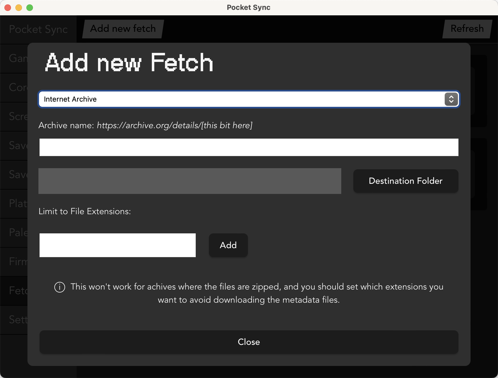

# Vectrex Extras


The Vectrex is a unique system that is stand alone from a TV. All graphics are vector-based, and you can add a transparent overlay on the screen to show some color, graphics, and instruction.

The Vectrex core was created by <a href="https://github.com/obsidian-dot-dev">Oblivion</a>. In version 0.9.1, when you execute the core, you choose a JSON file that corresponds to a ROM and an Overlay. The base implementation only includes JSON files for the official release set of 29ish games.

Vectrex Extras is a collection of JSON files based on a particular rom-pack that includes Homebrew games, Hacks, and much more. It's set up as a new core implementation of Vectrex so the new JSON files do not conflict with the JSON files in v0.9.1 of the Vectrex core.

## Usage Note

To install, copy all of the vectrex-extras.zip contents to your SD card. Again, this is a separate core compliation of the Vectrex core. You'll need to change cores to Vectrex-Extras in the openFPGA menu.

## Set-up Note #1

The distribution does not contain the actual RBF core flie. Please source it yourself from Obsidian's distribution.

Place the RBF file in the core folder, here:
- /Cores/obsidian.Vectrex/

## Set-up Note #2

All of the JSON files are set up using a particular rom-pack. Originally, this was meant to be the HTGDB pack, but it's slightly out of date. There are more games to play, and a few other things, too. The HTGDB pack will still work, but I added two more folders:

- (3) Vectrex Academy Student Works
- (4) More Homebrew and Hacks

You can find the updated rom-pack on Archive.org.  Just search for <b><a href="https://archive.org/search?query=openfpga+vectrex+extras">openfpga vectrex extras</a></b>.

## Usage Note #2

All Games have been tested on the Vectrex, but several of the Homebrew games and official games do not run in the Vectrex core. In particular, the Vectrex core does not support 3D games, Analogue input, and Light Pen input. So, I've put all of those games in the ```_broken``` folder. Other games in this folder don't boot or don't respond to input when they should.

**ALSO**, There are several games that don't run using Firmware 2.1 but do run using Firmware 2.2. Be sure you have the latest Analogue OS firmware installed on your Pocket.

## Pocket-Sync Fetch - Archive.org

If you use Pocket Sync for updating your cores, you can create a <b>Fetch</b> command to grab all of the files on Archive.org.



- Choose 'Internet Archive'
- Put in the archive key found at the end of the URL.
- Choose /Assets/vectrex/common/ as your destination
- Leave File Extensions blank, or type in bin, BIN, vec, ovr